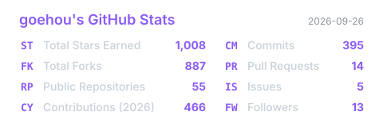
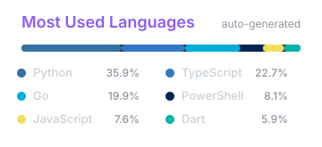

<h1 align="center">goehou</h1>

<p align="center">AI Agent engineer · MCP · TypeScript · Python · JavaScript</p>


```txt
┌─[goehou@github]─[~/workspace]
└──╼ $ ship --agents --mcp --automation
```

<h3 align="center">Stack</h3>

<p align="center">
  
</p>

<h3 align="center">Stats</h3>

<p align="center">
  
</p>

<p align="center">
  
</p>

<p align="center">
  
</p>

### Contributions

<picture>
  <source media="(prefers-color-scheme: dark)" srcset="https://raw.githubusercontent.com/goehou/goehou/output/github-contribution-grid-snake-dark.svg" />
  <source media="(prefers-color-scheme: light)" srcset="https://raw.githubusercontent.com/goehou/goehou/output/github-contribution-grid-snake.svg" />
  
</picture>

### Active Work
- [Visual-Enhancement-mcp](https://github.com/goehou/Visual-Enhancement-mcp) 
  MCP stdio server for image recognition via an existng vision model 一个可以增强claude code/codex/opencode识图能力的MCP
- [pi-feishu-monitor](https://github.com/goehou/pi-feishu-monitor) 
  Pi × 飞书 24/7 监控桥：手机远程控制 Pi、下任务、审批危险操作，长连接无需公网 IP
- [Juyu-phone-agent](https://github.com/goehou/Juyu-phone-agent) 
  📱 在 Android 手机上跑的通用 AI Agent · ♿ 无障碍服务操控界面 · 🔑 BYOK 多模型 · 🚫 不需要 Root 📱 A general-purpose AI Agent running on Android phones · ♿ Accessibility-driven UI control · 🔑 BYOK multi-model · 🚫 No Root required
- [tabbit-toy](https://github.com/goehou/tabbit-toy) 
  这是一个基于tabbit的研究包，可以转化成OAI格式出来，同时增加了会员认证功能和一键提取cookie的浏览器拓展，方便快速本地快速使用claude gpt等模型

### Recent Projects
- [Juyu-phone-agent](https://github.com/goehou/Juyu-phone-agent) 
  📱 在 Android 手机上跑的通用 AI Agent · ♿ 无障碍服务操控界面 · 🔑 BYOK 多模型 · 🚫 不需要 Root 📱 A general-purpose AI Agent running on Android phones · ♿ Accessibility-driven UI control · 🔑 BYOK multi-model · 🚫 No Root required
- [enterprise-kb-qa](https://github.com/goehou/enterprise-kb-qa) 
  企业知识库智能问答系统:Qwen2.5 + vLLM + RAG + LangChain Agent + LoRA 微调,一个项目打通大模型应用全链路(部署/RAG/Agent/微调/容器化
- [Happy-Code-Review](https://github.com/goehou/Happy-Code-Review) 
  Self-hosted multi-platform Git activity dashboard (GitLab/GitHub/Gitee) with built-in AI code review. Aggregates pushes, commits, diffs and code stats into one page. Flask + SQLite, single-file.
- [pi-feishu-monitor](https://github.com/goehou/pi-feishu-monitor) 
  Pi × 飞书 24/7 监控桥：手机远程控制 Pi、下任务、审批危险操作，长连接无需公网 IP

### Pull Requests

-  [docs(agent): Fix comments in top-level interfaces](https://github.com/influxdata/telegraf/pull/18518)
  [influxdata/telegraf](https://github.com/influxdata/telegraf)
-  [feat(service): add generic retry helper](https://github.com/atopos31/llmio/pull/65)
  [atopos31/llmio](https://github.com/atopos31/llmio)
-  [fix: 将 settings store 拆分为独立模块](https://github.com/J3n5en/EnsoAI/pull/323)
  [J3n5en/EnsoAI](https://github.com/J3n5en/EnsoAI)

### Recently Starred

- [atopos31/llmio](https://github.com/atopos31/llmio)  
  LLM API load-balancing gateway.
- [telagod/code-abyss](https://github.com/telagod/code-abyss)  
  Persona system for Claude Code / Codex CLI with workflow doctrine and output styles.
- [VeroFess/webshell](https://github.com/VeroFess/webshell)  
  Shared web console for Codex, Claude, and shell sessions, built with xterm.js.
